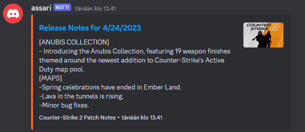

# discord-cs2updates

Simple discord bot that posts new Counter-Strike 2 patch notes to your discord server. I tried my best to make the application as easy to integrate as possible to your existing project.

# Demo



# Requirments

[Node.js](https://nodejs.org/en) version 16.9 or higher

#

# Setup

```
git clone https://github.com/GhettoSway/discord-cs2updates
npm install
```

Create `.env` and fill it as `.env.example`. `token` and `channelId` are necessary variables

- `token` is your bot's token
- `channelId` is the channel id, to which patch notes will be posted to
- `embedColor` is the color of the embed, as dec (defaults to orange if undefined)
- `thumbnail` is link to image, that will be set as embed thumbnail (defaults to discord server's icon if undefined)
- `interval` is time interval in seconds to check for new updates (defaults to 60 if undefined)

`npm start` to start the bot.

#

# Extending to post Counter-Strike blog posts

If you wish to track [Counter-Strike blog posts](https://www.counter-strike.net/news) too, you may extend the application to do so easily! In `fetchPatchNotes` function replace `if (event.event_type === 13) continue;` with

```javascript
if (event.event_type === 13) {
	// Handle blog post
}
```

# Contact

You may contact me via discord: fobba#9439
